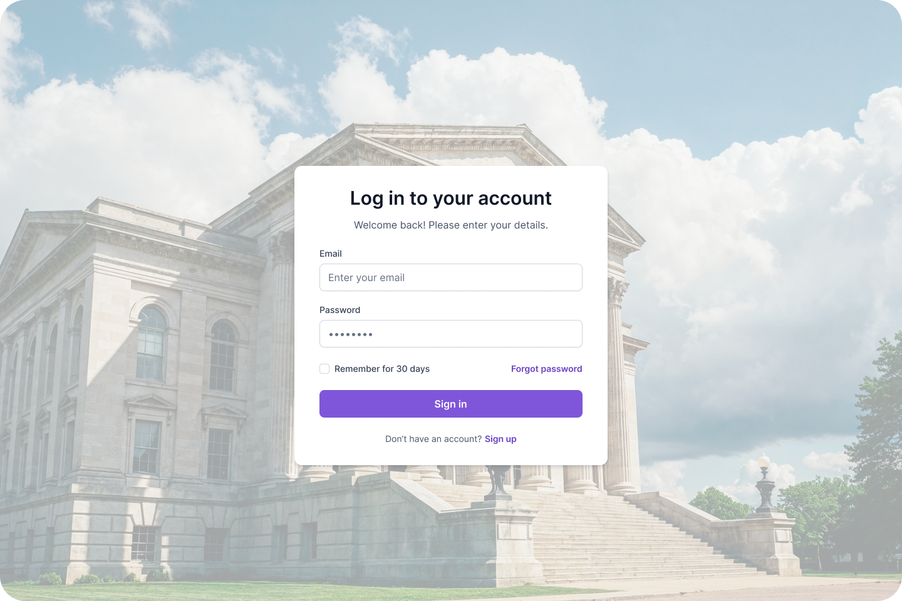
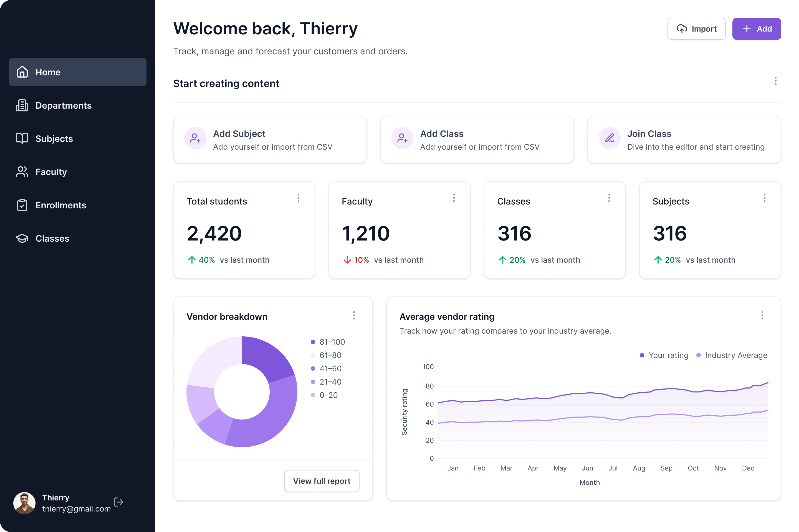
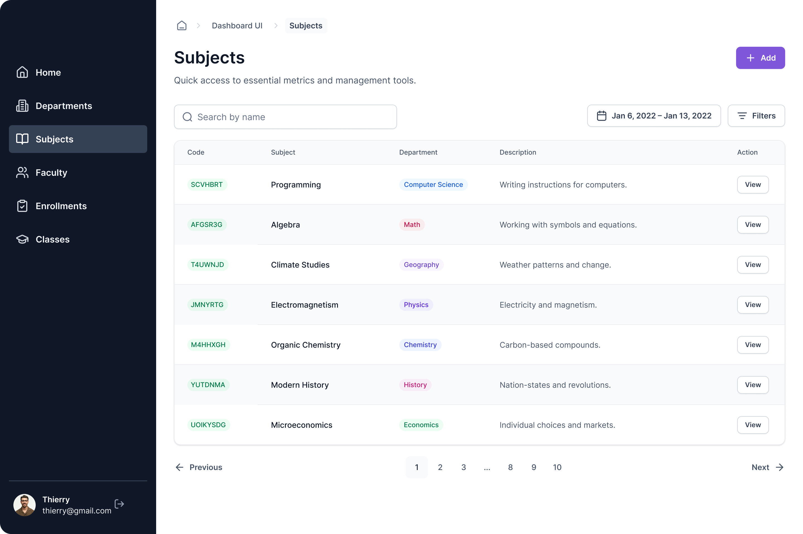
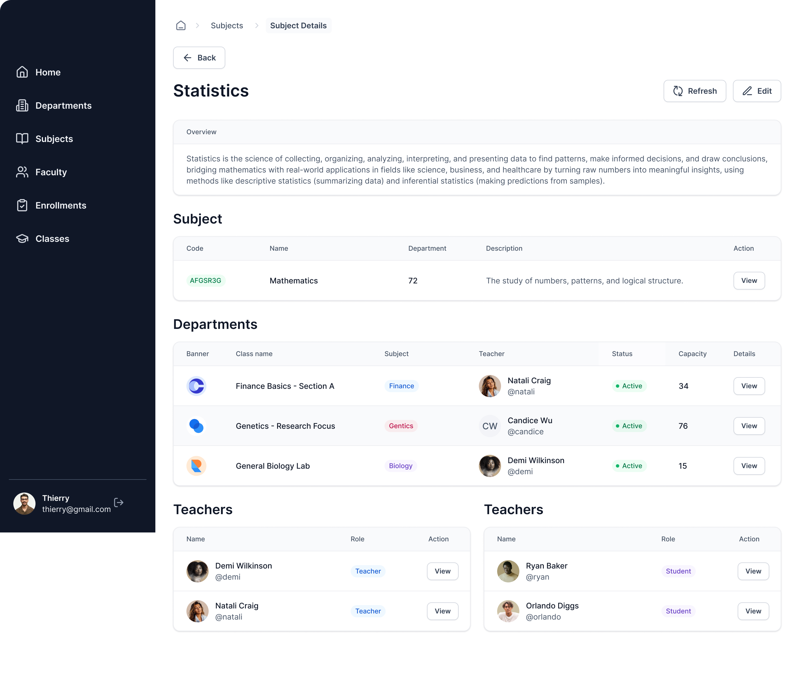
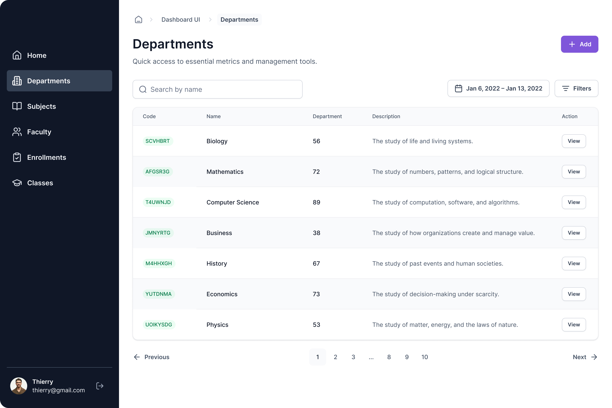
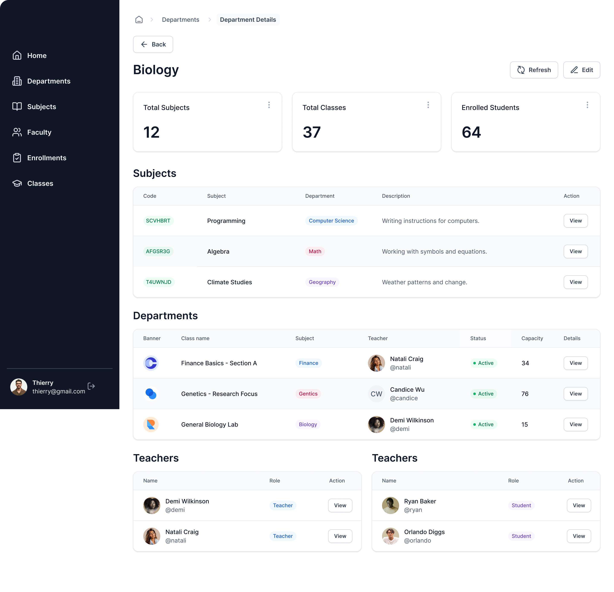
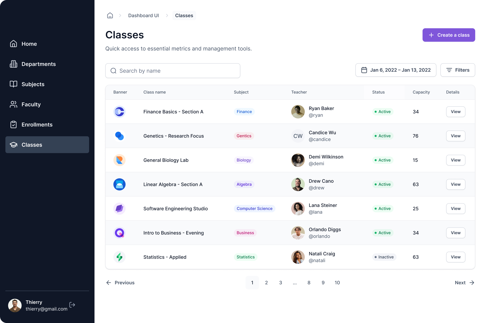
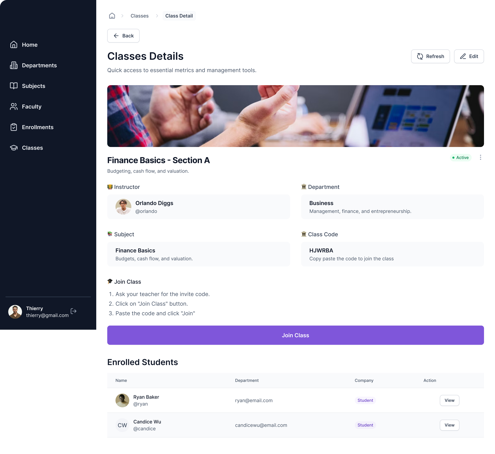
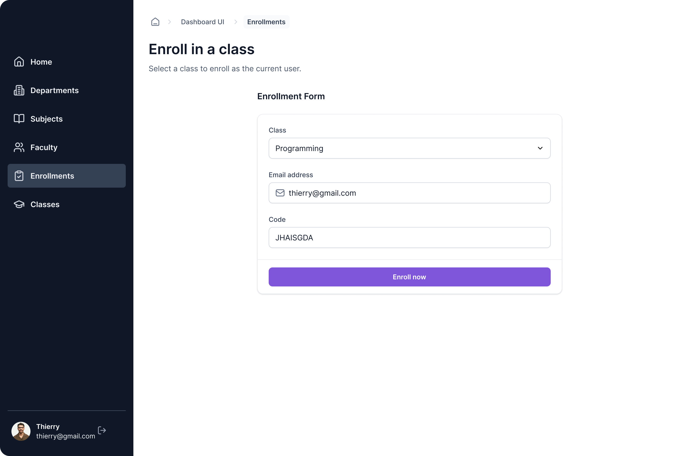
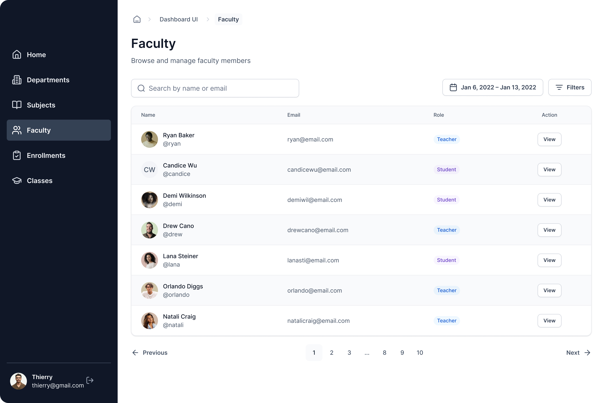
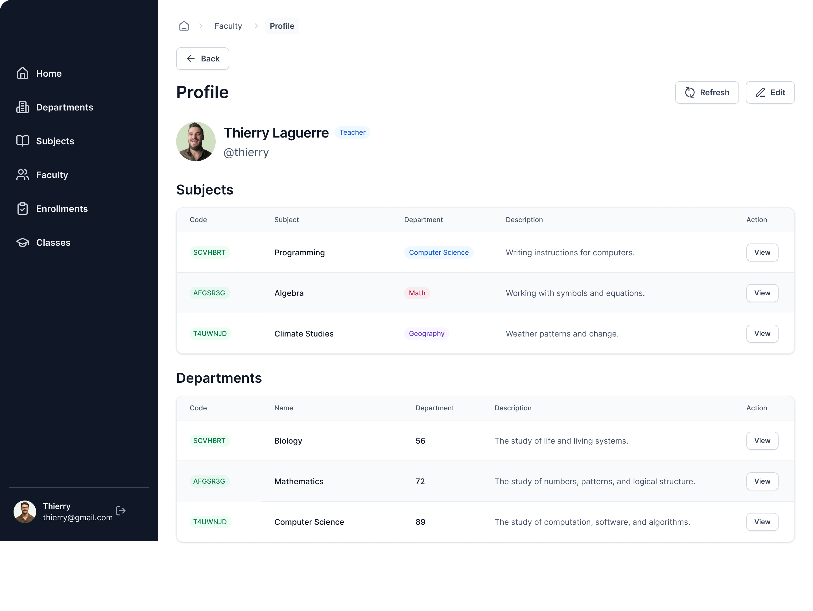

# University Management Dashboard (PERN Stack)

This project is a full-stack University Management Dashboard built using the PERN stack (PostgreSQL, Express.js, React.js, Node.js). The application is designed to manage university classes, subjects, and enrollments with role-based access control.

## Key Features

*   **Comprehensive CRUD Operations**: Manage subjects, departments, and classes.
*   **Database Integration**: Uses PostgreSQL with Drizzle ORM and Neon for serverless database connectivity.
*   **Modern Frontend**: Built with React and Vite, styled with Tailwind CSS and shadcn/ui, and powered by Refine for rapid data-driven UI development.
*   **Security & Authentication**: Implements Arcjet for security middleware and Better-Auth for user authentication.
*   **Media Management**: Integrated with Cloudinary for secure file and image uploads.
*   **Performance Monitoring**: Includes Site24x7 for APM (Application Performance Monitoring) and RUM (Real User Monitoring).
*   **AI-Assisted Development**: Accelerated workflow utilizing Junie AI and CodeRabbit for automated coding and PR reviews.

## Tech Stack

*   **Frontend**: React, Vite, Tailwind CSS, shadcn/ui, Refine
*   **Backend**: Node.js, Express.js
*   **Database**: PostgreSQL, Neon, Drizzle ORM
*   **Services**: Cloudinary, Arcjet, Site24x7

## Getting Started

*   **Prerequisites**: Ensure you have Node.js and npm installed.
*   **Setup**: Initialize the project using the provided CLI tools.
*   **Database**: Configure your Neon connection and apply schema migrations.
*   **Development**: Run the development server using `npm run dev` in both frontend and backend directories.

## Special Thanks

Acknowledgement of Adrian | JSMastery for providing guidance and assets.
